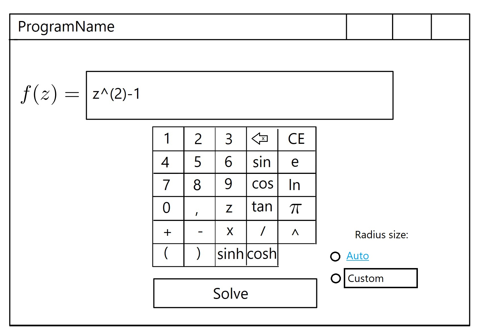
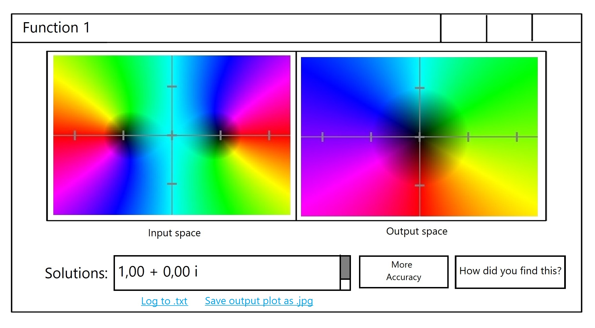

### Programowanie obiektowe | Specyfikacja projektu

_Piotr Machura, Kacper Ledwosiński_

# Kalkulator rozwiązujący i rysujący funkcje zespolone

## Cel główny

Celem projektu jest stworzenie kalkulatora znajdującego miejsca zerowe funkcji zespolonych zmiennej zespolonej. Użytkownik za pomocą interfejsu graficznego podaje funkcję, z której zostaje utworzony obiekt `Function` zawierający listę rozwiązań `solutions`. Następnie algorytm matematyczny wykorzystujący _"winding number"_ _(indeks punktu względem krzywej, patrz sekcja "Podłoże matematyczne")_ oraz rekurencyjną bisekcję na płaszczyźnie zespolonej **znajduje przybliżone miejsca zerowe** `Function` i umieszcza je w `solutions`, skąd mogą zostać **wyświetlone na ekran**.

Dodatkowo kalkulator wykorzystuje metodę kolorowania dziedziny aby wyświetlić obszary _input space_ i _output space_ funkcji _(patrz sekcja "Podłoże matematyczne)_ oraz rysuje przeprowadzaną na płaszczyźnie zespolonej bisekcję w czasie rzeczywistym.

## Podłoże matematyczne

### Metoda kolorowania dziedziny

NArysowanie wykresu funkcji $f: \mathbb{C}\rightarrow \mathbb{C}$ ze względu na naturę liczb zespolonych wymagałoby czterowymiarowego układu współrzędnych. Z pomocą przychodzi metoda kolorowania dziedziny, polegajaca na nadaniu każdemu punktowi w _input space_ koloru odpowiadającego fazie $\phi = arg(f(z))$ o jasności proporcjonalnej do $r=|f(z)|$. Pozwala to na łatwą wizualną ocenę przybliżonych miejsc zerowych.

### Indeks punktu względem krzywej

**Indeks punktu** $z_0$ **względem krzywej** $C$ jest to ilość okrążeń wykonywanych przez punkt $z$ wokół $z_0$ przy jednym okrążeniu krzywej $C$. Przyjmuje on zatem jedynie wartości całkowite lub 0, jeśli $z_0$ nie zawiera się wewnatrz krzywej $C$. Na płaszczyźnie zespolonej określony jest jako:

$$
W(C, z_0) = \frac{1}{2\pi i}\oint\limits_C \frac{dz}{z-z_0}
$$

Przyjmijmy, że punktem $z_0$ jest punkt $0+0i$ w _output space_. Mamy zatem:

$$
W(C) = \frac{1}{2\pi i}\oint\limits_C \frac{dz}{z}
$$

Rozważmy prostokąt **R** (w rozumieniu: krzywa będąca krawędzią prostokąta) zawierający się w _input space_ oraz oznaczmy jego obraz $C=f(R)$. Zatem jeśli indeks $W(C)\neq0$, to 0 _output space_ znajduje się wewnątrz $C$, a zatem **wewnątrz R znajduje się miejsce zerowe** $f$.

Liczbę obrotów _W_ nazywać będziemy dalej zamiennie z _winding number_ i jest to właściwość danego prostokąta **R**.

### Algortym szukający miejsc zerowych

Algorytm zaczyna więc od narysowania prostokąta wystarczająco dużego, aby zawarło się w nim co najmniej jedno miejsce zerowe (_ustawienie_ `Radius size - auto`). Następnie dzieli prostokąt na cztery mniejsze i sprawdza, czy _winding number_ każdego z nich jest niezerowy. Jeśli jest **zerowy**, to wewnątrz nie ma miejsca zerowego i taki prostokąt zostaje **odrzucony**. Jeśli jest **niezerowy**, to taki prostokąt zostaje znowu podzielony na cztery itd. (_tzw. struktura [quad tree](https://en.wikipedia.org/wiki/Quadtree)_)

Rekurencja zatrzymuje się w momencie, gdy pola prostokątów o niezerowym _W_ są **odpowiednio małe** i zwraca ich **środki** jako przybliżone miejsca zerowe funkcji.

## Interfejs użytkownika

Program akceptuje wzór funkcji zarówno z klawiatury jak z wbudowanych przycisków. Rozmiar początkowego prostokąta określa `Radius size` - `Auto` narysuje prostokąt wystarczająco duży, by znaleźć jedno miejsce zerowe, pole tekstowe `Custom` pozwala wprowadzić własny rozmiar startowego prostokąta. Po kliknięciu przycisku `Solve` otwiera się nowe okno z rozwiązaniem, podczas gdy główne okno pozostaje otwarte do dalszego wykorzystania.

Wykresy `Input space` i `Output space` można przewijać oraz ''rozszerzać'', okienko `Solutions` wyświetla listę znalezionych rozwiązań ( z suwakiem), przycisk `More Accuracy` pozwala dokładniej obliczyć miejsca zerowe (zmniejsza najmniejszy dopuszczalny prostokąt np. 10-krotnie), przycisk `How did you find this?` odtwarza na `Input space` animację algorytmu rysujacego prostokąty i liczącego ich _winding number_ w spowolnieniu (nie będzie też śledził całego procesu, tylko do pewnego momentu). Hiperłącza `Log to .txt` i `Save output as .jpg` robią to, co na nich pisze.

## Scenariusz użycia

Użytkownik wpisuje funckję którą chce rozwiązać i otrzymuje wykres oraz miejsca zerowe. program pozwala na otwarcie wielu okien `Function`, pozwalając porównywać wykresy i miejsca zerowe. Wyniki mogą zostać zapisane jako pliki .txt (rozwiązania) oraz .jpg (wykres `Output space`).

## Cele dodatkowe

-   Użycie systemu kontroli wersji `git`
-   Program napisany w `JavaFX`
-   Program wielojęzyczny (wersja po po polsku)
-   Program dostępny w licencji _Open Source_

## Terminarz realizacji projektu

1. Specyfikacja - III. zajęcia
2. Prototype - GUI, działający algorytm (dla zakodowanych ''na twardo'' funkcji) oraz kolorowanie dziedziny - V. zajęcia
3. Release candidate - obiekt `Function`, odczytywanie funkcji z przycisków, miejsca zerowe dowolnych funkcji - X. zajęcia
4. Final - odczytywanie funkcji z klawiatury, reszta funkcjonalności - XV. zajęcia

## Tabela zadań projektu

| Funkcjonalność                              | Max. pkt. | Uzyskane pkt. | Notatki                                                     |
| ------------------------------------------- | --------- | ------------- | ----------------------------------------------------------- |
| GUI                                         | ...       |               | Wprowadzanie funkcji przyciskami                            |
| Wprowadzanie funkcji z klawiatury           | ...       |               |                                                             |
| Kolorowanie dziedziny                       | ...       |               | Wraz z wyświetleniem i zapisywaniem do pliku .jpg           |
| Algorytm liczący _winding number_           | ...       |               | Wraz ze znajdowaniem miejsc zerowych i zapisywaniem do .txt |
| Rozwiązanie dowolnych złożeń funkcji        | ...       |               | Obiekt `Function` z podanych danych tworzy funkcję          |
| Rysowanie prostokątów w czasie rzeczywistym | ...       |               |                                                             |
| Użycie systemu `git`                        | ...       |               | https://github.com/piotrmachura16/AP4-project-java          |
| Wielojęzyczność programu                    | ...       |               | Język podstawowy: ENG                                       |
| Zapisywanie wyników do plików .jpg i .txt   | ...       |               | Język podstawowy: ENG                                       |
| **SUMA**                                    | ...       |               |                                                             |

Za poprawnie wykonany projekt chcielibyśmy uzyskać ocenę 5.
