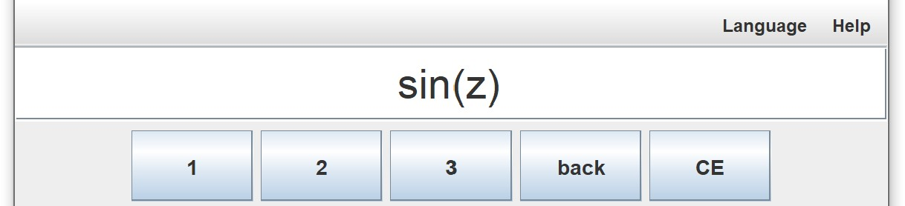
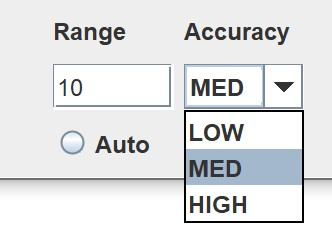
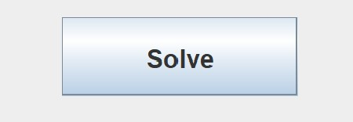
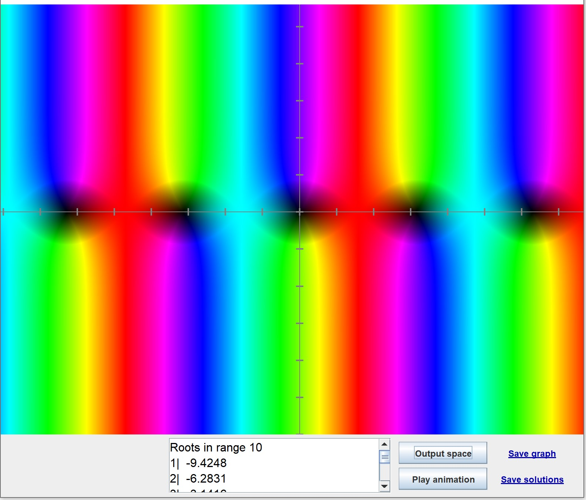

# Input your function

Input your complex function into the text field. You can use on-screen calculator buttons or just type with your keyboard.

Choose the desired `range` and `Accuracy Level`. Check the "Range Options" and "Accuracy Options" help documenst for more information.

Click `Solve` or press `Enter` in order to begin calculations.

The program may notify you about your input being invalid - in that case the input must be fixed before proceeding.

# View the results

A new window will open with a graph of your function. A the bottom you will see a text box with roots found by the algorithm. You can click `Output Space` button in order find what the colors mean. Clicking the `Play animation` button will open a new window with an animation representing the algorithm at work.

For saving results see article "Saving results".

For troubleshooting see section "Troubleshooting".