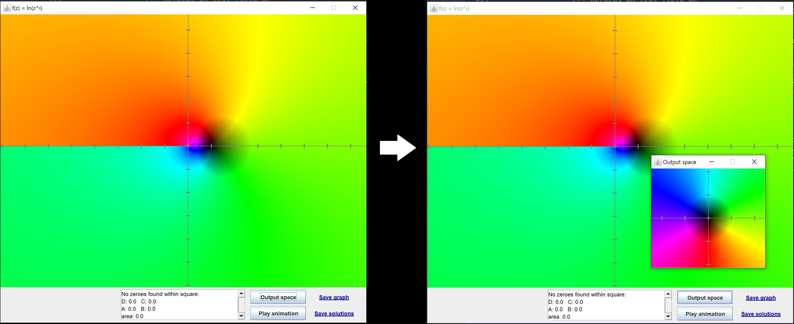

### Programowanie obiektowe | Etap "Prototype" projektu

_Piotr Machura, Kacper Ledwosiński_

# Kalkulator rozwiązujący i rysujący funkcje zespolone (***Complex solver***)
## Skrót specyfikacji

Celem projektu jest stworzenie kalkulatora rysującego oraz znajdującego miejsca zerowe funkcji zespolonych. Do znalezienia miejsc zerowych wykorzystywany jest **indeks punktu względem krzywej**, tj. ilość obrotów wykonywanych przez wektor wodzący zaczepiony w 0+0i *output space* podczas jednego okrążenia prostokąta $R$ w *input space*.Wykres rysowany jest  metodą **kolorowania dziedziny**.

### Zmiany dokonane w specyfikacji

Zrezygnowano z wykorzystania `JavaFX`, zamiast tego zostaną napisane testy `JUnittest` sprawdzające działanie programu.

Pasek menu pozwala wyświetlić okienko pomocy oraz zmienić jezyk programu.

Program akceptuje wzór funkcji zarówno z klawiatury jak z wbudowanych przycisków.

Rozmiar początkowego prostokąta określa `Range`. Opcja `Auto` narysuje prostokąt wystarczająco duży, by znaleźć jedno miejsce zerowe (po naciśnięciu przycisku wyświetla się ostrzeżenie), pole tekstowe pozwala wprowadzić własny rozmiar startowego prostokąta.

Menu `Accuracy` pozwala określić kiedy zakończyć rekurencję.

Po kliknięciu przycisku `Solve` otwiera się nowe okno z wykresem podanej funkcji, podczas gdy główne okno pozostaje otwarte do dalszego wykorzystania.

Pole tekstowe zawiera w sobie znalezione rozwiązania wraz z danymi na temat obszaru poszukiwań.

Przycisk `Output space` ukazuje miniaturowe okienko (*output space* jest takie samo niezależnie od funkcji, więc zdecydowano umieścić je w oddzielnym oknie).

Przycisk `Play animation` zmienia wykres na całkowicie czarny i rysuje na nim w zwolnionym tępie rekurencyjne tworzenie prostokątów prowadzące do znalezienia miejsc zerowych.

Hiperłącza `Save graph` i `Save zeroes` pozwalają zapisać wyniki działania programu.

