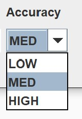

# Choosing accuracy

There are three accuracy options availible:

1. `LOW` will find roots accurately to about ~4 significant digits. It will result in the shortest calculation time.
2. `MED` will find roots accurately to about ~5 significant digits. It will result in a medium calculation time.
3. `HIGH` will find roots accurately to about ~6 significant digits. It will result in the lognest calculation time.