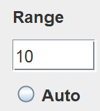

# Choosing your own range

Algorithm looks for solutions in a rectangle centered at the origin. `Range` denotes **half** the sidelength of that rectangle. This means that roots of |*Re*| < `Range` and |*Im*| < `Range` will be found.

# Using automatic range

`Auto` option will start with a rectangle of sidelenght 10 (`Range` of 5) and look for roots inside. If there are none, then it will look in a rectangle of sidelength 20 (`Range` of 10) and so on until it finds at least one root. Hwoever, it will terminate when it reaches sidelength of 200(`Range` of 100).

